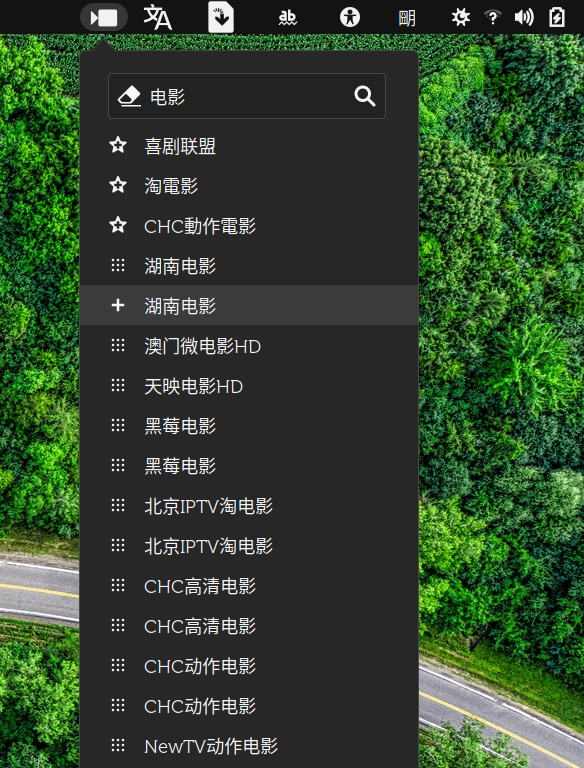

# gnome-shell-m3u8-play

[](https://extensions.gnome.org/extension/4824/m3u8-play/)

---

> 本来准备`git pull`自动更新流媒体地址的。扩展审查方，禁止自动更新扩展目录的文件，需要我一个一个获取，而且目标文件名又不固定，所以还是最终用户手动复制`m3u8`文件到`~/.local/share/m3u8-play/`目录吧。

- github有蛮多m3u8的仓库。
- 依赖ffplay(ffmpeg)。必须安装。

---

> Originally, I was going to 'git pull' automatically update the streaming media address. The extension reviewer prohibits automatic updating of files in the extension directory. I need to get them one by one, and the target file name is not fixed, so the end user should manually copy the 'm3u8' file to `~/.local/share/m3u8-play/` directory.

M3U8 format:
```
#EXTM3U
#EXTINF:-1 ,NAME-1
http://IP/tv000000/m3u8.php?/migu/625774640
#EXTINF:-1 ,NAME-2
http://IP/tv000000/m3u8.php?/migu/619495952
```

> When start, all m3u8 files in local share directory will be copy into `/tmp/m3u8.all` file. If you add a channel to favorite, it will saved in `favor.list` file (local share directory ).

favor.list format:
```
NAME-1,http://IP/tv000000/m3u8.php?/migu/625774640
NAME-2,http://IP/tv000000/m3u8.php?/migu/619495952
```

- GitHub has quite a lot m3u8 of repo.
- Ffplay (ffmpeg) must be installed.

---


